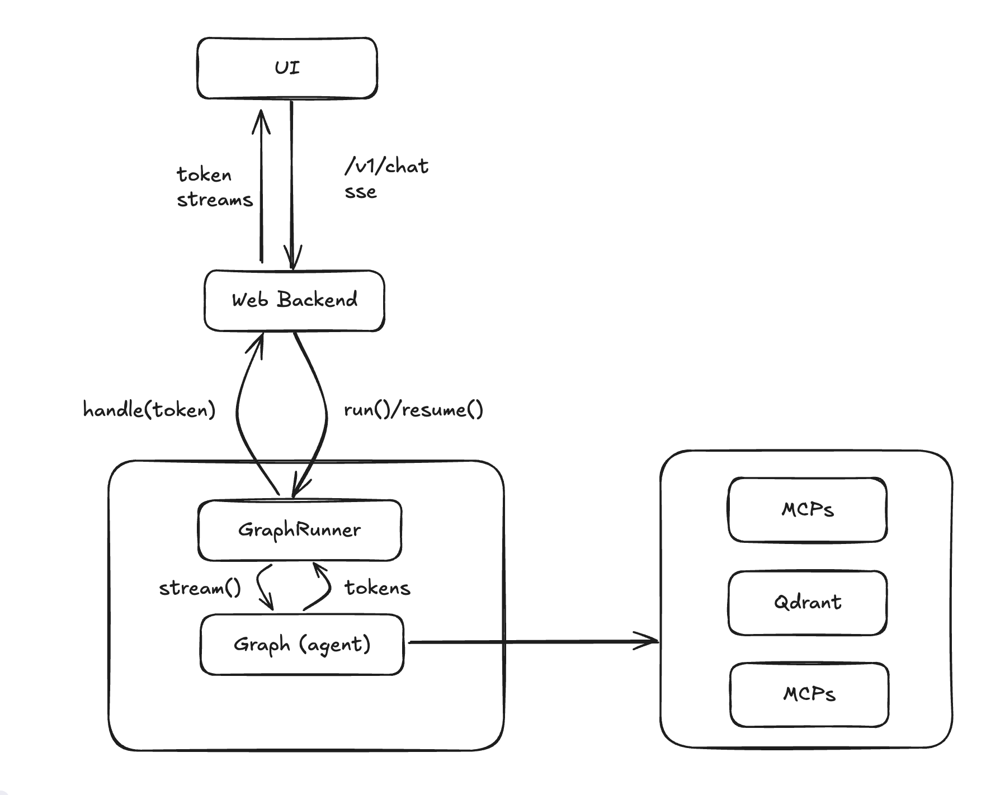

# 项目结构
该项目采用 mono repo 的方式管理。

- agent: web 服务器 + agent 实现
  - usecases: 业务流程，每个文件包含一个 graph
- mcp_xxx: MCP 服务器
- docs: 设计文档/图
- kb: 知识库

server 使用 [uv](https://www.uvicorn.org/) 管理。

tool 按需使用 [conda](https://anaconda.org/anaconda/conda) 或者 `uv`

项目中根目录中每个目录都是单独的子项目，**不是** python 包。每个字项目可以是
- 可执行的项目，例如 服务器，agent。
- 依赖库。

可执行项目中，python 入口可以放在子项目根目录。依赖库中，代码 **必须** 组织在 src 目录中。参考 [uv 官方文档](https://docs.astral.sh/uv/concepts/projects/init/)

引用依赖项目时，**必须** 使用包管理工具，不要基于路径来引入。

运行代码文件时，**必须** 使用包管理工具。例如
```
cd agent/
uv run usecases/antibody/planning.py
```

引入子项目内的 python 文件时，**必须** 使用子项目内的相对路径。例如
```
# 要这样
from common.***

# 不要这样
from agent.common.***
```

# 项目架构



# 如何部署
```sh
make run
```
或者手动部署
- [构建前端](./ui/README.md)
- [启动后端](./agent/README.md)